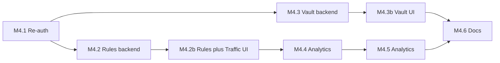

# GuardMe Plan (M4 — Vault, Rules, Re-Auth, Analytics)

## Frontend API convention

Each feature uses an abstract `*Api` class + `Http*Api` (or `SocketRealtimeApi` for live events), registered directly in `provideGuardMeApi()`. Backend must be running; test against real NestJS endpoints.

## What is already done (M1 + M2 + M3)

| Area | Status |
|------|--------|
| Auth, sessions, fingerprint, JWT cookie | Done |
| Proxy (dual-port), VirusTotal, **PolicyService** (verdict → ALLOW/BLOCK/WARN) | Done |
| SIEM persistence + WebSocket live stream | Done |
| Health / system status | Done |
| Angular dashboard: login, live feed, traffic + security history | Done |
| `ReAuthGuard` class | Done — verify-password + ReauthDialog wired |

## M4 completed (2026-06-18)

| Milestone | Status |
|-----------|--------|
| M4.1 / M4.1b Re-auth | Done |
| M4.2 / M4.2b Rules + traffic columns | Done |
| M4.3 / M4.3b Vault CRUD | Done |
| M4.4 Analytics API | **Next** |
| M4.5 Analytics UI | Pending |
| M4.6 Docs | Pending |

## What M4 delivers

| MVP / course item | M4 target |
|-------------------|-----------|
| Local encrypted password vault | M4.3 + M4.3b |
| Full **CRUD** for vault credentials | M4.3 API + M4.3b UI (Create, Read list, Read one/decrypt, Update, Delete) |
| Re-authentication after inactivity | M4.1 + M4.1b |
| Allow/Block **policy engine** (spec) | M4.2 — extend with visible system rules + **user custom rules** |
| Security analytics view | M4.4 + M4.5 |
| RxJS **zip**, **forEach**, switchMap, merge | M4.5 analytics + existing dashboard merge |
| SIEM signal quality | No `THREAT_SCAN_COMPLETED` noise in `security_events` |

**Deferred to M5:** UEBA, behavioral baseline, threat push notifications, password generator, VMware deep dive.

---

## Design decisions (user feedback incorporated)

### 1. Do not log `THREAT_SCAN_COMPLETED` to `security_events`

**Agreed — good idea.**

Every proxied request already creates a `traffic_logs` row with verdict, risk score, URL, and destination metadata. VirusTotal outcome lives there (and in scan metadata if needed). Logging `THREAT_SCAN_COMPLETED` per request **duplicates** traffic logs and floods the Security tab.

**Policy for M4:**

| Log to `security_events` | Do not log |
|--------------------------|------------|
| `MALICIOUS_BLOCKED`, `AUTH_FAILURE`, `FINGERPRINT_MISMATCH`, `VT_UNAVAILABLE`, `SUSPICIOUS_PROCEED`, `VAULT_*`, `REAUTH_FAILURE`, `PROXY_ERROR`, `RULE_MATCH` (custom rule block) | `THREAT_SCAN_COMPLETED`, routine `SAFE` scans |

**M4.2 action:** Remove/guard any existing `THREAT_SCAN_COMPLETED` emitters in threat/proxy pipeline; document allowed event types in `config/siem.config.ts`.

---

### 2. User-visible policy / rules engine + Rules tab

**Agreed — not overkill; strengthens the spec’s “Allow/Block policy engine” story.**

Today [PolicyService](apps/gateway-backend/src/modules/proxy/policy.service.ts) maps VirusTotal verdict → decision internally but the user cannot see or extend rules. M4 adds:

**System rules (read-only, displayed in UI)** — derived from `PolicyService`:

| Condition | Decision |
|-----------|----------|
| Threat verdict `MALICIOUS` | BLOCK |
| Threat verdict `SUSPICIOUS` | WARN |
| Threat verdict `SAFE` | ALLOW |
| Threat verdict `UNVERIFIED` | ALLOW (elevated risk) |
| `riskScore >= POLICY_BLOCK_RISK_THRESHOLD` (env, e.g. 85) | BLOCK |
| Simulated file scan `MALICIOUS` | BLOCK |

**User custom rules (CRUD, stored in DB):**

| Field | Example |
|-------|---------|
| `ruleType` | `DOMAIN`, `IP` |
| `pattern` | `ads.example.com`, `203.0.113.50` |
| `action` | `BLOCK` or `ALLOW` (whitelist exception) |
| `enabled` | true/false |
| `name` | optional label (“Block ads domain”) |

**Evaluation order in proxy pipeline:**

```
1. User BLOCK rules (domain/IP match) → BLOCK immediately, log RULE_MATCH
2. User ALLOW whitelist rules → ALLOW (skip VT optional — recommend skip for trusted domains)
3. Threat scan (VirusTotal) + file scan
4. PolicyService system rules (verdict + risk threshold)
5. Forward / block / warn page
```

**Frontend:** New side-nav tab **Rules** (`/rules`) alongside Dashboard, Traffic, Security.

---

### 3. Traffic tab enhancements

**Agreed — data mostly exists; UI + one schema field needed.**

Current `traffic_logs` has `clientIp` (source), `destinationIp`, `destinationHost`, `verdict`. `verdict` mixes concepts today.

**M4.2 schema addition:**

```prisma
model TrafficLog {
  // existing fields...
  policyDecision String @map("policy_decision")  // ALLOW | BLOCK | WARN
  threatVerdict  String? @map("threat_verdict")   // SAFE | MALICIOUS | ...
  matchedRuleId  String? @map("matched_rule_id") // if user rule fired
}
```

**Traffic table columns (M4.2b):**

| Column | Source |
|--------|--------|
| Time | `timestamp` |
| Method | `method` |
| URL / Host | `url`, `destinationHost` |
| **Source IP** | `clientIp` |
| **Destination IP** | `destinationIp` (resolve when possible) |
| Threat verdict | `threatVerdict` |
| **Decision** | `policyDecision` (ALLOW / BLOCK / WARN) |
| Risk | `riskScore` |

Live dashboard feed can show the same decision chip styling.

---

## Why this order



1. **Re-auth first** — vault and sensitive rule changes need fresh password.
2. **Rules before vault** — core firewall story; independent of crypto; improves demo flow.
3. **Traffic UI with rules** — immediate visible value from rules work.
4. **Vault** — largest security feature; full CRUD.
5. **Analytics** — uses enriched traffic logs.
6. **Docs** — capture everything.

**Workflow:** one todo → discuss → implement → pause for commit → **"please continue"**.

---

## M4 implementation sequence

### M4.1 — Re-authentication API (backend)

*(unchanged from prior plan)*

1. `POST /auth/verify-password` — JwtSessionGuard, Argon2 verify, update `last_auth_at`
2. Log `REAUTH_FAILURE` on failure; optional `SESSION_EVENT` on success
3. Document `ReAuthGuard` usage for vault + rule mutations

---

### M4.1b — Re-authentication UI (frontend)

*(unchanged)*

1. `AuthApi.verifyPassword`, `ReauthDialogComponent`, stale-session indicator

---

### M4.2 — Policy rules engine (backend)

**Goal:** User custom rules + clearer traffic decisions; SIEM hygiene.

**Steps:**

1. Prisma `FirewallRule` model + migration; relation on `User`.
2. `modules/rules/rules.service.ts` — CRUD scoped to `userId`; `evaluateRules(request, userId): RuleMatchResult | null`
3. `modules/rules/rules.controller.ts`:
   - `GET /rules` — list user rules + **system rules** (static JSON from config, not DB)
   - `POST /rules` — create (JwtSessionGuard + ReAuthGuard)
   - `PATCH /rules/:id` — update
   - `DELETE /rules/:id` — delete
4. Extend [proxy pipeline](apps/gateway-backend/src/modules/proxy/proxy-pipeline.service.ts): evaluate user rules **before** threat scan; pass match into `PolicyService` if needed.
5. Extend `traffic_logs` with `policyDecision`, `threatVerdict`, `matchedRuleId`; update `SiemService.logTraffic`.
6. **SIEM hygiene:** remove `THREAT_SCAN_COMPLETED` (and similar per-scan noise) from `security_events`; log `RULE_MATCH` only when a user rule blocks/allows with security relevance.
7. Env: `POLICY_BLOCK_RISK_THRESHOLD=85` in `.env.example`.

**Verify:** Custom BLOCK rule for domain → request blocked without VT call; traffic row shows `policyDecision=BLOCK` and `matchedRuleId`; Security tab has no scan-completed spam.

---

### M4.2b — Rules tab + Traffic table UI (frontend)

**Goal:** Visible policy engine; clearer traffic forensics.

**Steps:**

1. `RulesApi` + HTTP; ngrx `rules` feature (entity adapter, CRUD effects with `switchMap`).
2. Route `/rules` + shell nav link **Rules**.
3. **Rules page:**
   - **System rules** section — read-only cards/table (from `GET /rules` system portion)
   - **My rules** section — Material table with enable toggle, edit, delete
   - **Add rule** dialog — type (domain/IP), pattern, action BLOCK/ALLOW, name
4. **Traffic page updates:**
   - Columns: source IP (`clientIp`), destination IP (`destinationIp`), **decision** (`policyDecision`), threat verdict
   - Decision chips: ALLOW green, BLOCK red, WARN amber (match dashboard)
5. RxJS: use **`forEach`** when building export/filter chip list from active filters (course requirement); **`filter`** + **`map`** on client-side column formatters.

**Verify:** Add rule blocking `example.net` → browse to it → blocked; traffic row shows IPs + decision; rule appears in list.

---

### M4.3 — Vault backend (crypto + full CRUD)

**Goal:** Encrypted credentials; all CRUD operations explicit.

| Operation | Endpoint | Notes |
|-----------|----------|-------|
| **Create** | `POST /vault/credentials` | Encrypt password; requires unlock + ReAuthGuard |
| **Read list** | `GET /vault/credentials` | Metadata only (no passwords) |
| **Read one** | `GET /vault/credentials/:id` | Decrypted password; requires unlock |
| **Update** | `PATCH /vault/credentials/:id` | Re-encrypt on password change |
| **Delete** | `DELETE /vault/credentials/:id` | Hard delete row |
| Unlock/Lock | `POST /vault/unlock`, `POST /vault/lock` | Key lifecycle |

Plus: `kdfSalt` on register, `CryptoService` Argon2 KDF + AES-256-GCM, in-memory key cache cleared on logout.

**Verify:** DB shows ciphertext only; all five CRUD paths work via API.

---

### M4.3b — Vault UI (full CRUD)

**Goal:** Course CRUD + spec vault UI.

1. ngrx vault entities: load list, create, update, delete effects
2. UI: list, add dialog, edit dialog, view/copy password, delete confirm
3. Unlock banner when vault locked
4. Wire `ReauthDialog` on 401

**Verify:** Full credential lifecycle from UI without plaintext in DB.

---

### M4.4 — Security analytics API (backend)

*(largely unchanged; use `policyDecision` breakdown in summary)*

1. `GET /siem/analytics/summary` — verdict + **decision** counts, top hosts, risk stats, time buckets

---

### M4.5 — Security analytics UI (frontend)

**Goal:** Analytics view + explicit RxJS operator coverage.

| Operator | Where in M4 |
|----------|-------------|
| `switchMap` | Vault save, rules CRUD, analytics date reload |
| `merge` | Dashboard live feed (M3, retained) |
| `takeUntil` | WS teardown on logout |
| **`zip`** | Analytics page: `zip(analyticsSummary$, systemStatus$)` combined load |
| **`forEach`** | Analytics: build chart series — ` buckets.forEach(b => series.push(...))` inside pipe, or `tap` with forEach on verdict groups |
| `map`, `filter`, `reduce` | Traffic stats selectors, filter bar |

1. `/analytics` route with verdict/decision charts, top hosts, security event breakdown
2. Document operators in code comments only where natural (no forced/obvious usage)

---

### M4.6 — Documentation and polish

1. `Documentation/architecture.md` — include **Rules evaluation pipeline** diagram
2. `Documentation/threat-model.md`
3. `Documentation/m4-smoke-test.md` — re-auth, rules, vault CRUD, analytics, traffic columns
4. `config/siem.config.ts` — document allowed `security_events` types (no scan completed)
5. README demo script: login → show rules → block custom domain → vault CRUD → analytics
6. Vault lock on logout

---

## Suggested structure after M4

```
apps/gateway-backend/src/modules/
  rules/              (NEW)
    rules.module.ts
    rules.service.ts
    rules.controller.ts
  vault/              (NEW)

apps/dashboard-frontend/src/app/
  features/
    rules/            (NEW)
    vault/            (NEW)
    analytics/        (NEW)
  store/
    rules/
    vault/
    analytics/
```

---

## Manual verification (end of M4)

1. Security tab has no per-request `THREAT_SCAN_COMPLETED` noise.
2. System rules visible on `/rules`; custom domain block works.
3. Traffic table shows source IP, destination IP, decision.
4. Vault full CRUD; ciphertext only in DB.
5. Re-auth enforced for vault and rule changes.
6. Analytics uses `zip`; course operators demonstrable.
7. Complete `m4-smoke-test.md`.

---

## Execution style

**One todo at a time.** Before each: steps, questions, suggestions. After each: pause for commit → **"please continue"**.

**First step when approved:** **M4.1** — re-auth API.
