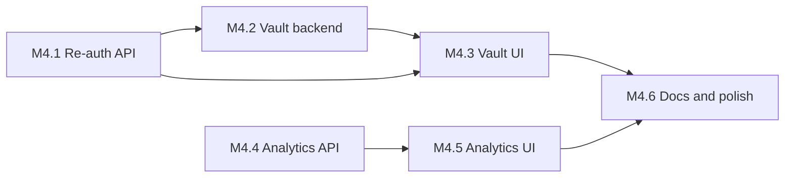

# GuardMe Plan (M4 — Vault, Re-Auth, Analytics, Lab Readiness)

## What is already done (M1 + M2 + M3)

| Area | Status |
|------|--------|
| Auth, sessions, fingerprint, JWT cookie | Done |
| Proxy (dual-port), VirusTotal, policy, block/warning pages | Done |
| SIEM persistence + WebSocket live stream | Done |
| Health / system status | Done |
| Angular dashboard: login, live feed, traffic + security history | Done ([m3-smoke-test.md](Documentation/m3-smoke-test.md)) |
| `ReAuthGuard` class | Exists but **not wired** — no verify-password endpoint, no UI |

## What MVP still requires ([project-specification.txt](Resources/project-specification.txt))

| Requirement | M4 target |
|-------------|-----------|
| Local encrypted password vault | M4.2 backend + M4.3 frontend |
| Encryption-at-rest AES-256-GCM, KDF from master password | M4.2 `CryptoService` |
| Re-authentication after inactivity | M4.1 backend + M4.1b frontend |
| Dashboard security analytics view | M4.4 backend + M4.5 frontend |
| Evaluation: vault encrypted, re-auth enforced | M4 smoke test |

**Deferred to M5 (optional / Phase 2):** UEBA, behavioral baseline, threat push notifications, password generation, VMware two-VM demo scripts, advanced analytics.

---

## Why this order



1. **Re-auth first** — spec ties vault access to fresh password confirmation; `ReAuthGuard` already exists in [re-auth.guard.ts](apps/gateway-backend/src/common/guards/re-auth.guard.ts) but needs `POST /auth/verify-password` to refresh `last_auth_at`.
2. **Vault backend** — new Prisma model + crypto; no frontend until API is stable.
3. **Vault UI** — integrates re-auth unlock dialog + CRUD; one vertical slice.
4. **Analytics** — uses existing `traffic_logs` / `security_events`; no new proxy work.
5. **Docs + polish** — submission-ready lab story.

**Workflow (same as M1–M3):** one todo at a time → agent presents steps + questions + suggestions → you approve → implement → pause for manual commit → **"please continue"**.

---

## Cryptography design (M4.2)

Per spec threat model:

```
Master password + per-user kdfSalt
        ↓
Argon2id KDF  →  Vault encryption key (32 bytes, RAM only)
        ↓
AES-256-GCM encrypt credential passwords
        ↓
DB stores: ciphertext, iv, auth tag (separate columns or combined)
```

**Security practices:**

- `kdfSalt` — random 16+ bytes per user, stored in `users` table (not secret; salt is public).
- Vault key lives in `CryptoService` in-memory `Map<userId, { key, derivedAt }>` — cleared on logout and session revoke.
- Auth password hash (login) and vault KDF use **different contexts** (Argon2 with distinct `associatedData` or separate pepper strings) so DB leak of `password_hash` does not directly yield vault key.
- Never log master password, derived keys, or plaintext credentials.
- Vault routes: `JwtSessionGuard` + `ReAuthGuard` + optional explicit unlock step for decrypt operations.
- Rate-limit verify-password endpoint (reuse existing throttler from auth).

**Prisma additions:**

```prisma
model User {
  // existing fields...
  kdfSalt String @map("kdf_salt")
  vaultCredentials VaultCredential[]
}

model VaultCredential {
  id                String   @id @default(uuid())
  userId            String   @map("user_id")
  serviceName       String   @map("service_name")
  username          String
  encryptedPassword String   @map("encrypted_password")
  iv                String
  authTag           String   @map("auth_tag")
  createdAt         DateTime @default(now()) @map("created_at")
  updatedAt         DateTime @updatedAt @map("updated_at")
  user User @relation(...)
  @@index([userId])
  @@map("vault_credentials")
}
```

---

## M4 implementation sequence

### M4.1 — Re-authentication API (backend)

**Goal:** Satisfy evaluation criterion *"re-authentication enforced"* and unblock vault.

**Steps:**

1. Add `POST /auth/verify-password` in [auth.controller.ts](apps/gateway-backend/src/modules/auth/auth.controller.ts):
   - Body: `{ password: string }` (reuse `LoginDto` shape or new `VerifyPasswordDto`)
   - Guards: `JwtSessionGuard` only (not `ReAuthGuard` — user is stale by definition)
   - On success: verify Argon2id against `password_hash`, set `last_auth_at = now()`, return `{ verified: true }`
   - On failure: generic 401, log `REAUTH_FAILURE` via `SiemService`
2. Optionally emit `SESSION_EVENT` on success for dashboard toast.
3. Apply `ReAuthGuard` to a placeholder or document which routes will use it (vault routes in M4.2).
4. Update [.env.example](apps/gateway-backend/.env.example) if needed (`REAUTH_TIMEOUT_MINUTES` already present).

**Verify:** Login → wait or manually age `last_auth_at` → `POST /auth/verify-password` → `last_auth_at` updated; `ReAuthGuard`-protected test route returns 200.

---

### M4.1b — Re-authentication UI (frontend)

**Goal:** User can confirm password from dashboard without full logout.

**Steps:**

1. `AuthApi.verifyPassword(password)` — real HTTP + mock stub.
2. Shared `ReauthDialogComponent` (Material dialog): password field, submit, error handling.
3. `ReauthService` or auth effect: callable from vault and future sensitive actions; on 401 with "Re-authentication required" from API, auto-open dialog.
4. Optional: toolbar indicator when session is "stale" (compare `lastAuthAt` from profile vs `REAUTH_TIMEOUT_MINUTES`).

**Verify:** Stale session → open vault or trigger protected action → dialog → success refreshes access.

---

### M4.2 — Vault backend (crypto + CRUD)

**Goal:** Encrypted credential storage; keys never persisted.

**Steps:**

1. Prisma migration: `kdfSalt` on `User`, `VaultCredential` model.
2. On **register**: generate `kdfSalt`, store on user row.
3. `modules/vault/crypto.service.ts`:
   - `deriveVaultKey(masterPassword, kdfSalt): Buffer`
   - `encrypt(plaintext, key) → { ciphertext, iv, authTag }`
   - `decrypt(...)` 
   - In-memory key cache with `unlock(userId, password)` / `lock(userId)` / `clearAll()`
4. `modules/vault/vault.service.ts` — CRUD scoped to `userId`; encrypt on write, decrypt only when key in memory.
5. `modules/vault/vault.controller.ts`:
   - `POST /vault/unlock` — body `{ password }`, derives key into memory, updates `last_auth_at`
   - `POST /vault/lock` — clear key from memory
   - `GET /vault/credentials` — list metadata (service, username; **no** password)
   - `POST /vault/credentials` — create (requires unlock + `ReAuthGuard`)
   - `GET /vault/credentials/:id` — returns decrypted password (requires unlock + `ReAuthGuard`)
   - `PATCH /vault/credentials/:id` — update
   - `DELETE /vault/credentials/:id`
6. Guards: `JwtSessionGuard` on all; `ReAuthGuard` on mutating + decrypt routes.
7. SIEM: log `VAULT_UNLOCK`, `VAULT_ACCESS`, `VAULT_CRUD` security events (no secrets in metadata).

**Verify:** Create credential → inspect DB (ciphertext only) → decrypt via API after unlock → logout clears memory key.

---

### M4.3 — Vault UI (frontend integration)

**Goal:** Spec Phase 5 vault UI; CRUD satisfies course "CRUD operations for entities."

**Steps:**

1. Models: `VaultCredential`, `VaultCredentialDetail`, `VaultUnlockState`.
2. `VaultApi` abstraction + mock + `HttpVaultApi`.
3. ngrx `vault` feature: entities adapter, unlock/lock actions, CRUD effects (`switchMap` for save/delete).
4. Routes: `/vault` in [app.routes.ts](apps/dashboard-frontend/src/app/app.routes.ts); nav link in shell.
5. Pages/components:
   - **Vault list** — table/cards: service name, username, actions (view/edit/delete)
   - **Unlock banner** — if vault locked, prompt master password (calls `/vault/unlock` or verify + unlock flow)
   - **Add/Edit dialog** — service, username, password fields
   - **View password** — brief reveal with copy button; requires unlock + re-auth
6. Wire `ReauthDialog` when API returns re-auth required.

**Verify:** Full CRUD from UI; DB remains encrypted; lock on logout.

---

### M4.4 — Security analytics API (backend)

**Goal:** Lightweight analytics from existing logs — **not** full UEBA (Phase 2).

**Steps:**

1. `GET /siem/analytics/summary?from=&to=` — protected, scoped to current user:
   - Traffic counts by verdict (`ALLOW`, `BLOCK`, `SAFE`, `MALICIOUS`, etc.)
   - Top 10 `destinationHost` by request count
   - Average / max `riskScore` in range
   - Security event counts by `severity` and `type`
   - Time-bucketed series (e.g. hourly counts for last 24h) for charts
2. Implement in [siem.service.ts](apps/gateway-backend/src/modules/siem/siem.service.ts) or dedicated `analytics.service.ts` with efficient Prisma `groupBy` / raw queries using existing indexes.
3. DTO: `AnalyticsSummaryDto`.

**Verify:** After browsing via proxy, summary reflects real traffic distribution.

---

### M4.5 — Security analytics UI (frontend)

**Goal:** Spec "Security analytics view" on dashboard.

**Steps:**

1. `AnalyticsApi` + mock + HTTP implementation.
2. ngrx `analytics` slice + effect (`switchMap` on date range filter).
3. New route `/analytics` or expand dashboard with tab:
   - Verdict pie/bar (Material or CSS)
   - Timeline chart (simple bar per hour — avoid heavy chart libs unless you prefer one small dependency)
   - Top hosts table
   - Security events breakdown
4. RxJS: `zip` or `forkJoin` to load summary + existing health status for combined view.

**Verify:** Date range change reloads analytics; numbers match DB/traffic page.

---

### M4.6 — Documentation, lab readiness, polish

**Goal:** Submission-ready project; optional single-machine + two-VM guides.

**Steps:**

1. `Documentation/architecture.md` — diagram: Browser → Proxy → Threat → SIEM → Dashboard; module map.
2. `Documentation/threat-model.md` — summarize spec assumptions + what GuardMe protects.
3. `infrastructure/vmware/setup-guide.md` — two-VM layout (optional) + **single-machine local dev** section (already validated in M3).
4. `Documentation/m4-smoke-test.md` — vault + re-auth + analytics checklist.
5. Root [README.md](README.md) — quick start, env vars, demo flow for professor.
6. Code polish: remove dead mocks if unused, consistent error messages, vault lock on session revoke hook in `AuthService.logout`.

**Verify:** New developer can follow README and complete smoke test in < 30 minutes.

---

## Suggested structure after M4

```
apps/gateway-backend/src/modules/
  vault/           (NEW)
    crypto.service.ts
    vault.service.ts
    vault.controller.ts
    vault.module.ts
    dto/

apps/dashboard-frontend/src/app/
  features/
    vault/         (NEW)
    analytics/     (NEW)
  store/
    vault/
    analytics/
```

---

## Course requirements — M4 coverage

| Requirement | M4 |
|-------------|-----|
| NestJS CRUD entities | Vault credentials CRUD |
| Passport auth | Already done; re-auth extends it |
| Angular components, DI, routing | Vault + analytics features |
| ngrx store, entities, effects | Vault + analytics slices |
| RxJS switchMap, merge/zip | Vault CRUD effects, analytics load |

---

## Manual verification (end of M4)

1. Login → browse via proxy → dashboard still live (regression).
2. Wait > `REAUTH_TIMEOUT_MINUTES` (or age DB) → vault access prompts re-auth → verify password → access granted.
3. Add vault entry → confirm DB has only ciphertext/iv/authTag.
4. Logout → vault key cleared; cannot decrypt until unlock.
5. Analytics page shows verdict breakdown matching traffic history.
6. Complete [m4-smoke-test.md](Documentation/m4-smoke-test.md).

---

## Execution style

**One todo at a time.** Before each: implementation steps, clarifying questions, suggestions. After each: summary, pause for your commit, continue on **"please continue"**.

**First step when approved:** **M4.1** — `POST /auth/verify-password` + SIEM events + `ReAuthGuard` wiring plan for vault.
