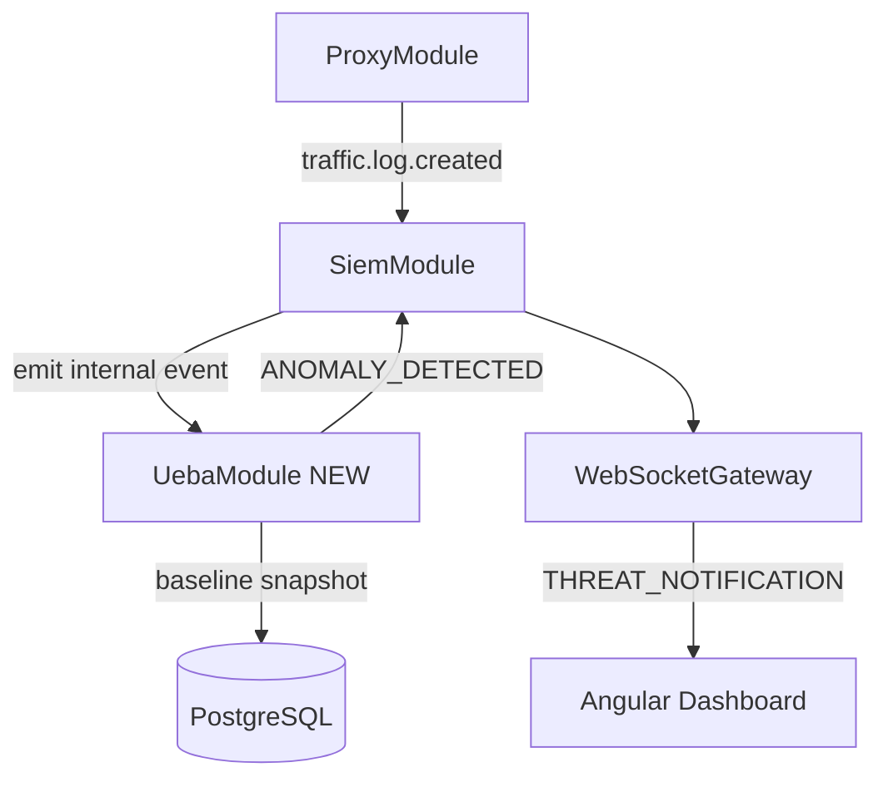

# GuardMe Plan (M5 — Intelligence, Notifications, Lab & Submission)

## Assumed state after M4 (complete system)

| Milestone | Delivered |
|-----------|-----------|
| M1 | Auth, sessions, fingerprint, Prisma |
| M2 | Proxy, VirusTotal, SIEM, WebSocket, health |
| M3 | Angular dashboard core + live/history integration |
| M4 | Re-auth, encrypted vault, analytics, base docs |

**MVP evaluation criteria** from [project-specification.txt](Resources/project-specification.txt) are all satisfied after M4:

- Traffic through gateway, malicious URLs blocked, logs per request
- Vault encrypted at rest, re-auth enforced, dashboard live activity

M5 targets **Phase 2 (SHOULD HAVE)**, **select COULD HAVE** items, and **submission/lab packaging** — not new MVP blockers.

---

## M5 goal

Transform GuardMe from a working personal gateway into a **demonstrable security platform** with:

1. **Behavioral awareness** — learn normal browsing patterns for the single user
2. **UEBA-style anomaly detection** — score and flag deviations
3. **Threat notifications** — surface high-signal events in the dashboard in real time
4. **Stronger event-driven architecture** — formal module boundaries via domain events
5. **Lab deployment story** — VMware two-VM (or documented single-machine) demo for professor
6. **Submission package** — performance notes, screenshots, API spec, final smoke test

**Out of M5 scope:** HTTPS MITM, kernel firewall, enterprise AV, multi-device distribution (COULD HAVE — defer to future).

---

## Architecture after M5



**New backend module:** `modules/ueba/` (baseline + scoring + listeners) — keeps SIEM focused on persistence/emission, UEBA on analysis.

---

## Why this order

1. **Baseline before scoring** — anomalies need a reference model.
2. **Scoring before notifications** — notifications need something meaningful to alert on (not just raw `SECURITY_EVENT` flood).
3. **Event catalog early in M5.2** — wires proxy → SIEM → UEBA without tight coupling.
4. **Notifications UI** — consumes new WebSocket payloads; visible demo win.
5. **Password generator** — small vault enhancement; independent, low risk.
6. **Lab + performance last** — documents a finished system; includes screenshots of M5 features.

**Workflow (unchanged):** one todo → discuss steps/questions → implement → pause for commit → **"please continue"**.

---

## M5 implementation sequence

### M5.1 — Behavioral baseline (backend)

**Goal:** Persist a per-user "normal activity" profile from historical `traffic_logs`.

**Steps:**

1. Prisma model `BehaviorBaseline` (or JSON column on dedicated table):

```prisma
model BehaviorBaseline {
  id        String   @id @default(uuid()) @db.Uuid
  userId    String   @unique @map("user_id") @db.Uuid
  snapshot  Json     // structured baseline metrics
  sampleSize Int     @map("sample_size")
  windowDays Int     @default(7) @map("window_days")
  updatedAt DateTime @updatedAt @map("updated_at")
  user User @relation(...)
  @@map("behavior_baselines")
}
```

2. `modules/ueba/baseline.service.ts` — compute from last N days of `traffic_logs` for user:
   - Active hours histogram (0–23)
   - Top 20 `destinationHost` frequencies
   - Avg requests per hour, per day
   - Typical verdict distribution
   - Unique hosts per day (median)
3. `POST /ueba/baseline/refresh` — manual recompute (JwtSessionGuard); auto-refresh on schedule optional stub.
4. `GET /ueba/baseline` — return current snapshot for dashboard.
5. Minimum sample guard: if &lt; 50 traffic rows, return `insufficient_data` (no false anomalies).

**Verify:** Browse for a few days (or seed script) → refresh baseline → JSON reflects host/time patterns.

---

### M5.2 — UEBA anomaly scoring + event-driven wiring (backend)

**Goal:** Spec "UEBA-style anomaly scoring" + "modular event-driven communication."

**Steps:**

1. `modules/ueba/anomaly.service.ts` — `scoreTrafficEvent(userId, trafficLogRow, baseline): AnomalyResult`
   - Signals (weighted):
     - **New host** — `destinationHost` not in baseline top hosts and never seen in last 7 days
     - **Volume spike** — current hour request count &gt; 3× baseline hourly average
     - **Off-hours activity** — request during hours with &lt; 5% baseline activity
     - **Repeated blocks** — &gt; 3 `BLOCK`/`MALICIOUS` verdicts in 10 minutes
     - **High risk cluster** — avg `riskScore` &gt; 70 in last 15 minutes
   - Output: `anomalyScore` (0–100), `signals: string[]`, `severity: low|medium|high`
2. `modules/ueba/ueba.listener.ts` — `@OnEvent('traffic.log.created')` (emit from [siem.service.ts](apps/gateway-backend/src/modules/siem/siem.service.ts) after persist):
   - Load baseline; if missing, skip
   - Score event; if `anomalyScore >= threshold` (env `UEBA_ALERT_THRESHOLD`, default 60):
     - `SiemService.logSecurityEvent({ type: 'ANOMALY_DETECTED', ... })`
     - Emit `ueba.anomaly.detected` for notifications module
3. Formalize **domain event catalog** in `config/events.config.ts`:

| Event | Publisher | Subscribers |
|-------|-----------|-------------|
| `traffic.log.created` | SiemService | UebaListener, (future) |
| `security.event.created` | SiemService | WebSocket gateway |
| `ueba.anomaly.detected` | UebaListener | NotificationService |
| `session.event` | AuthService | WebSocket gateway |

4. Register `UebaModule` in [app.module.ts](apps/gateway-backend/src/app.module.ts).

**Verify:** Simulate off-hours burst or new rare host → `ANOMALY_DETECTED` in `security_events` with score + signals in metadata.

---

### M5.3 — Threat notifications (backend + WebSocket)

**Goal:** Spec "Threat notifications" — distinct, user-visible alerts.

**Steps:**

1. `modules/notifications/notification.service.ts` (lightweight — can live under `ueba/` or `siem/`):
   - Maps high-severity events to `ThreatNotificationPayload`: `{ id, type, title, message, severity, timestamp, metadata }`
   - Trigger types: `ANOMALY_DETECTED`, `MALICIOUS_BLOCKED`, `FINGERPRINT_MISMATCH`, `VT_UNAVAILABLE`, `SUSPICIOUS_PROCEED`
2. Extend WebSocket client events in [websocket.config.ts](apps/gateway-backend/src/config/websocket.config.ts):

```typescript
THREAT_NOTIFICATION: 'THREAT_NOTIFICATION'
```

3. `@OnEvent` listeners emit `THREAT_NOTIFICATION` to user room (same pattern as `TRAFFIC_LOG`).
4. Hook existing proxy block / fingerprint / VT-fail paths to call `NotificationService` (avoid duplicate DB rows — notification is a **view** over security event, not always a second write).

**Verify:** Block malware test URL → dashboard receives `THREAT_NOTIFICATION` within 1s.

---

### M5.4 — Threat notifications UI (frontend)

**Goal:** Visible security UX for demo and Phase 2 story.

**Steps:**

1. Extend `RealtimeApi` / socket handler for `THREAT_NOTIFICATION`.
2. ngrx `notifications` feature: entity adapter, `upsertNotification`, `dismissNotification`, selectors for unread count.
3. UI components:
   - **Notification bell** in shell toolbar with badge (`@Input` count)
   - **Notification panel** (Material menu or sidenav drawer) — list with severity chips, dismiss, click → navigate to `/security` filtered by type
   - **Toast/snackbar** for `high` severity (Material `MatSnackBar`, auto-dismiss)
4. RxJS: `notifications$` filtered stream; `takeUntil` on logout clears slice.
5. Optional: `/notifications` history page (reads from `security_events` where severity >= medium) — reuse existing SIEM API.

**Verify:** Trigger anomaly + block → bell badge increments; toast appears; panel shows details.

---

### M5.5 — Vault password generator (COULD HAVE)

**Goal:** Spec optional password generation; small UX win for vault.

**Steps:**

1. `shared/utils/password-generator.util.ts` — cryptographically secure (`crypto.getRandomValues`), configurable length (12–32), charset toggles (upper, lower, numbers, symbols).
2. Add **Generate** button to vault Add/Edit dialog — fills password field client-side only (never sent until user saves).
3. No backend required unless you want `GET /vault/generate-password` — **recommend client-only** for simplicity and security (no password over wire twice).

**Verify:** Generate → copy → save credential → decrypt shows same password.

---

### M5.6 — Advanced analytics / UEBA dashboard (frontend)

**Goal:** "Advanced analytics dashboards" (light COULD HAVE) — builds on M4 analytics.

**Steps:**

1. `GET /ueba/anomalies?from=&to=` — paginated `ANOMALY_DETECTED` events with scores (or filter `security_events` by type).
2. Extend `/analytics` page (or new `/insights` tab):
   - **Anomaly timeline** — scores over time (bar/line from bucketed data)
   - **Baseline summary card** — top hosts, active hours heatmap (simple CSS grid)
   - **Risk trend** — avg risk score per day (`map`/`reduce` on client or server)
3. ngrx effects: `zip(baseline$, analyticsSummary$, anomalies$)` for combined load.
4. Link from notification panel → filtered anomaly view.

**Verify:** Analytics reflects baseline refresh date and anomaly history after M5.2 triggers.

---

### M5.7 — VMware lab deployment + dev scripts

**Goal:** Spec Phase 1 infrastructure + repo structure `scripts/`, `infrastructure/vmware/`.

**Steps:**

1. `infrastructure/vmware/network-diagram.md` — ASCII or Mermaid: User VM (browser) ↔ Gateway VM (NestJS + Docker Postgres) ↔ Internet; label IPs (e.g. 192.168.56.10 / .20).
2. `infrastructure/vmware/setup-guide.md`:
   - Two-VM VMware Workstation/Fusion setup
   - Gateway VM: Docker, clone repo, `.env`, migrate, `npm start`
   - User VM: browser proxy → gateway IP:8080, dashboard → gateway IP:3000 (or port-forward)
   - Single-machine fallback section (localhost dev)
3. `scripts/start-dev.ps1` / `start-dev.sh` — start Postgres container, backend, frontend in sequence.
4. `scripts/seed-demo.ts` — optional: seed user, sample traffic_logs, refresh baseline for demo without live browsing.
5. Update [browser-proxy.md](infrastructure/proxy-config/browser-proxy.md) with VM IP examples.

**Verify:** Follow guide on clean VM (or document single-machine path); complete smoke test end-to-end.

---

### M5.8 — Performance measurement + final submission package

**Goal:** Spec "Gathering results" + `docs/` completion for professor submission.

**Steps:**

1. `Documentation/gathering-results.md`:
   - Evaluation criteria checklist (all ✅ after M4+M5)
   - **Performance observations** (manual measurements):
     - Proxy latency: `curl -x localhost:8080 -w '%{time_total}'` with/without VT
     - VirusTotal scan time (from logs or stopwatch)
     - WebSocket: count events/sec during burst browsing
     - Gateway VM CPU/RAM (Task Manager / `docker stats`)
2. `Documentation/api-spec.md` — OpenAPI-style summary of all REST + WebSocket events (auth, siem, vault, ueba, health).
3. `Documentation/screenshots/` — capture: dashboard live, block page, vault, analytics, notification toast, VMware diagram.
4. `Documentation/m5-smoke-test.md` — full system regression: M3 + M4 + M5 anomaly trigger + notification.
5. Root README — "Demo script for presentation" (5-minute walkthrough bullets).
6. Final code polish: env examples for `UEBA_ALERT_THRESHOLD`, `BASELINE_WINDOW_DAYS`; remove unused mocks; consistent naming.

**Verify:** Another person can run demo script + gathering-results doc without author help.

---

## Suggested structure after M5

```
apps/gateway-backend/src/modules/
  ueba/
    ueba.module.ts
    baseline.service.ts
    anomaly.service.ts
    ueba.listener.ts
    ueba.controller.ts
    dto/
  notifications/          # or nested under ueba/
    notification.service.ts

apps/dashboard-frontend/src/app/
  features/
    notifications/        # bell, panel
  store/
    notifications/
```

---

## Phase 2 / COULD HAVE coverage

| Spec item | M5 todo |
|-----------|---------|
| Behavioral baseline detection | M5.1 |
| UEBA-style anomaly scoring | M5.2 |
| Threat notifications | M5.3 + M5.4 |
| Modular event-driven communication | M5.2 event catalog |
| Password generation | M5.5 |
| Advanced analytics dashboards | M5.6 |
| Multi-device distribution | Deferred (future) |

---

## Manual verification (end of M5)

1. Baseline refresh after sufficient browsing history.
2. Off-hours or new-host browsing triggers anomaly + `THREAT_NOTIFICATION`.
3. Malicious URL block shows notification toast + security history entry.
4. Vault password generator works on add-credential form.
5. `/analytics` or `/insights` shows baseline + anomaly timeline.
6. VMware (or single-machine) setup guide reproducible.
7. `gathering-results.md` filled with real performance numbers.
8. Complete `m5-smoke-test.md`.

---

## Execution style

**One todo at a time.** Before each: implementation steps, clarifying questions, suggestions. After each: summary, pause for manual commit, continue on **"please continue"**.

**First step when approved:** **M5.1** — `BehaviorBaseline` model + `BaselineService` + refresh/get API.
